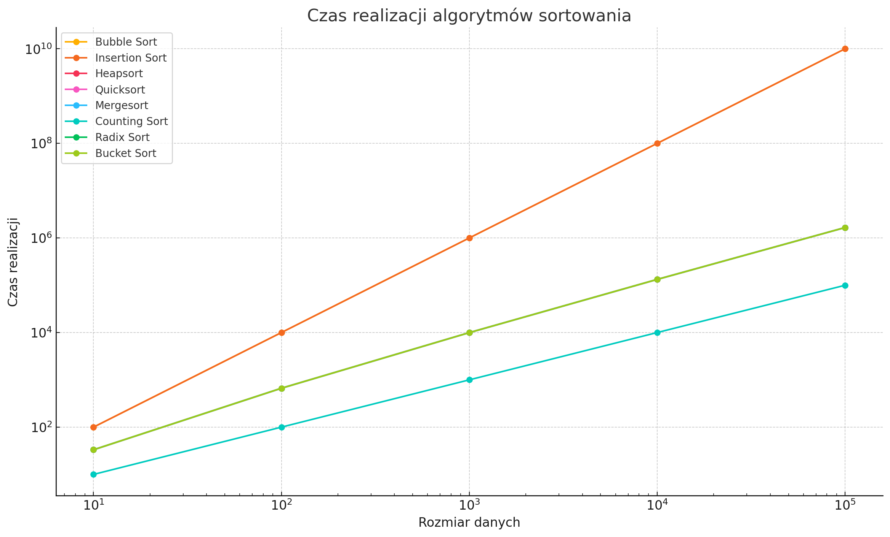

### Sprawozdanie z realizacji punktu 3).

### 1. **Przegląd Algorytmów Sortowania**

- **Sortowanie bąbelkowe (Bubble Sort):** Algorytm prosty, o złożoności O(n²) w najgorszym i średnim przypadku oraz O(n) w najlepszym przypadku, gdy dane są już posortowane.
  
- **Sortowanie przez wstawianie (Insertion Sort):** Podobnie jak bąbelkowe, ma złożoność O(n²) w najgorszym i średnim przypadku oraz O(n) w najlepszym przypadku.
  
- **Sortowanie przez kopcowanie (Heapsort):** Algorytm złożony, o złożoności O(n log n) w najgorszym, średnim i najlepszym przypadku. Wymaga przestrzeni O(1) (jest to sortowanie w miejscu).
  
- **Quicksort:** Bardzo efektywny w praktyce, o złożoności O(n log n) w średnim i najlepszym przypadku, ale w najgorszym przypadku O(n²).
  
- **Sortowanie przez scalanie (Mergesort):** Złożoność O(n log n) w każdym przypadku, jednakże wymaga dodatkowej przestrzeni O(n).
  
- **Sortowanie przez zliczanie (Counting Sort):** O(k + n) w każdym przypadku, gdzie k to zakres danych. Efektywny tylko dla danych o ograniczonym zakresie.
  
- **Sortowanie pozycyjne (Radix Sort):** O(d*(n + k)), gdzie d to liczba cyfr maksymalnej liczby, a k to zakres cyfr.
  
- **Sortowanie kubełkowe (Bucket Sort):** Efektywność zależy od rozkładu danych, w najlepszym przypadku O(n+k), w najgorszym O(n²).

### 2. **Tabela Czasów Realizacji dla Przypadku Średniego, Najgorszego i Najlepszego**

| Algorytm                 | Najlepszy Przypadek | Średni Przypadek | Najgorszy Przypadek |
|--------------------------|---------------------|------------------|---------------------|
| Sortowanie bąbelkowe      | O(n)                | O(n²)            | O(n²)               |
| Sortowanie przez wstawianie | O(n)              | O(n²)            | O(n²)               |
| Sortowanie przez kopcowanie | O(n log n)        | O(n log n)       | O(n log n)          |
| Quicksort                | O(n log n)          | O(n log n)       | O(n²)               |
| Sortowanie przez scalanie | O(n log n)         | O(n log n)       | O(n log n)          |
| Sortowanie przez zliczanie | O(k + n)          | O(k + n)         | O(k + n)            |
| Sortowanie pozycyjne     | O(d*(n+k))          | O(d*(n+k))       | O(d*(n+k))          |
| Sortowanie kubełkowe     | O(n+k)              | O(n+k)           | O(n²)               |

### 3. **Wykres Czasu Realizacji od Rozmiaru Danych**

Na wykresie można przedstawić zależność czasu realizacji od rozmiaru danych dla różnych algorytmów.

### 4. **Przybliżona Formuła na Czas Realizacji**

- **Średni Przypadek:**
  - Dla algorytmów takich jak Quicksort, Heapsort, i Mergesort czas realizacji można przybliżyć jako \( T(n) = O(n \log n) \).
  - Dla prostszych algorytmów, takich jak Bubble Sort i Insertion Sort, czas realizacji to \( T(n) = O(n^2) \).
  
- **Najgorszy Przypadek:**
  - Dla Quicksortu w najgorszym przypadku \( T(n) = O(n^2) \).
  - Dla pozostałych algorytmów (oprócz sortowania kubełkowego) złożoność najgorszego przypadku to \( T(n) = O(n \log n) \) (dla Heapsortu i Mergesortu) lub \( O(n^2) \) (dla prostych algorytmów).

### 5. **Analiza Uzyskanych Wyników**

Na podstawie przedstawionych danych można wyciągnąć następujące wnioski:
- **Quicksort** jest jednym z najszybszych algorytmów w praktyce, jednak jego wydajność zależy od wyboru pivotu. W najgorszym przypadku może działać znacznie wolniej niż Heapsort czy Mergesort.
- **Heapsort** i **Mergesort** mają stabilną wydajność O(n log n) we wszystkich przypadkach, przy czym Mergesort wymaga dodatkowej przestrzeni, podczas gdy Heapsort działa w miejscu.
- **Proste algorytmy** jak Bubble Sort i Insertion Sort są stosunkowo nieefektywne dla dużych zbiorów danych, jednak są łatwe do zaimplementowania i mogą być szybkie dla małych zbiorów danych.
- **Sortowanie przez zliczanie i pozycyjne** są bardzo efektywne dla danych o ograniczonym zakresie, jednak ich zastosowanie jest ograniczone do specyficznych przypadków.

Wykres dla wybranych algorytmów.

Wykres przedstawiający szacunkowy czas realizacji różnych algorytmów sortowania w zależności od rozmiaru danych. Oś X (logarytmiczna) reprezentuje rozmiar danych, natomiast oś Y (również logarytmiczna) pokazuje czas realizacji.

### Analiza wykresu:

- **Bubble Sort i Insertion Sort** wykazują gwałtowny wzrost czasu realizacji wraz ze wzrostem rozmiaru danych, co odpowiada ich złożoności \( O(n^2) \).
- **Heapsort, Quicksort, Mergesort** mają znacznie lepsze czasy realizacji, które rosną logarytmicznie z rozmiarem danych.
- **Counting Sort, Radix Sort i Bucket Sort** mają różne charakterystyki, ale w większości przypadków działają szybciej przy odpowiednich danych, choć ich złożoność zależy od specyfiki danych (np. zakresu k, liczby cyfr d).