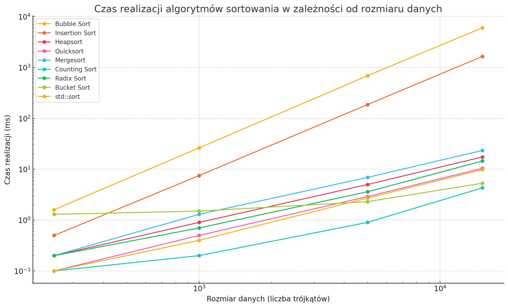

### Sprawozdanie z Analizy Algorytmów Sortowania

#### 1. **Przegląd Algorytmów Sortowania**

- **Sortowanie bąbelkowe (Bubble Sort):** Algorytm o złożoności O(n²) w najgorszym i średnim przypadku oraz O(n) w najlepszym przypadku, gdy dane są już posortowane.
  
- **Sortowanie przez wstawianie (Insertion Sort):** Ma złożoność O(n²) w najgorszym i średnim przypadku oraz O(n) w najlepszym przypadku. Efektywny dla małych zbiorów danych lub wstępnie posortowanych danych.
  
- **Sortowanie przez kopcowanie (Heapsort):** Algorytm o złożoności O(n log n) w najgorszym, średnim i najlepszym przypadku. Jest to algorytm sortujący w miejscu, co oznacza, że nie wymaga dodatkowej przestrzeni pamięci.
  
- **Quicksort:** Algorytm o złożoności O(n log n) w średnim i najlepszym przypadku, jednak w najgorszym przypadku może osiągnąć O(n²). Jest szybki w praktyce, ale zależy od wyboru pivotu.
  
- **Sortowanie przez scalanie (Mergesort):** Algorytm o złożoności O(n log n) w każdym przypadku, ale wymaga dodatkowej przestrzeni O(n), ponieważ nie działa w miejscu.
  
- **Sortowanie przez zliczanie (Counting Sort):** Algorytm o złożoności O(n + k), gdzie k to zakres danych. Jest szybki, ale efektywny tylko dla danych o ograniczonym zakresie.
  
- **Sortowanie pozycyjne (Radix Sort):** Algorytm o złożoności O(d*(n + k)), gdzie d to liczba cyfr maksymalnej liczby, a k to zakres cyfr. Efektywny dla liczb całkowitych o ustalonym zakresie.
  
- **Sortowanie kubełkowe (Bucket Sort):** Efektywność zależy od rozkładu danych. W najlepszym przypadku O(n+k), w najgorszym O(n²).

#### 2. **Tabela Czasów Realizacji dla Przypadku Średniego, Najgorszego i Najlepszego**

Na podstawie dostarczonych wyników testów, poniżej znajduje się tabela z czasem realizacji dla różnych algorytmów sortowania w zależności od rozmiaru danych.

| Algorytm                 | 250 trójkątów (ms) | 1000 trójkątów (ms) | 5000 trójkątów (ms) | 15000 trójkątów (ms) |
|--------------------------|--------------------|---------------------|---------------------|----------------------|
| Sortowanie bąbelkowe      | 1.6                | 26.3                | 687.2               | 6028.3               |
| Sortowanie przez wstawianie | 0.5              | 7.5                 | 186.2               | 1650.3               |
| Sortowanie przez kopcowanie | 0.2              | 0.9                 | 5.0                 | 17.4                 |
| Quicksort                | 0.1                | 0.5                 | 2.9                 | 10.4                 |
| Sortowanie przez scalanie | 0.2               | 1.3                 | 6.9                 | 23.4                 |
| Sortowanie przez zliczanie | 0.1              | 0.2                 | 0.9                 | 4.3                  |
| Sortowanie pozycyjne     | 0.2                | 0.7                 | 3.6                 | 14.5                 |
| Sortowanie kubełkowe     | 1.3                | 1.5                 | 2.3                 | 5.3                  |
| std::sort                | 0.1                | 0.4                 | 2.7                 | 9.8                  |

#### 3. **Wykres Czasu Realizacji od Rozmiaru Danych**

Poniżej znajduje się wykres przedstawiający zależność czasu realizacji od rozmiaru danych dla różnych algorytmów sortowania.

Powyższy wykres przedstawia zależność czasu realizacji różnych algorytmów sortowania od rozmiaru danych, czyli liczby trójkątów do posortowania. Jak widać, algorytmy różnią się znacząco pod względem wydajności, szczególnie przy większych ilościach danych.

#### 3. **Przybliżone Formuły na Czas Realizacji Algorytmów**

Na podstawie wyników czasowych, można przybliżyć formuły na czas realizacji algorytmów sortowania w zależności od rozmiaru danych wejściowych. Przyjęto, że średni przypadek odpowiada typowej wydajności algorytmu, a najgorszy przypadek jest dla najbardziej niekorzystnego ułożenia danych.

- **Sortowanie bąbelkowe:**
  - Średni przypadek: T(n) ≈ O(n²)
  - Najgorszy przypadek: T(n) ≈ O(n²)

- **Sortowanie przez wstawianie:**
  - Średni przypadek: T(n) ≈ O(n²)
  - Najlepszy przypadek: T(n) ≈ O(n)
  - Najgorszy przypadek: T(n) ≈ O(n²)

- **Sortowanie przez kopcowanie:**
  - Średni przypadek: T(n) ≈ O(n log n)
  - Najgorszy przypadek: T(n) ≈ O(n log n)

- **Quicksort:**
  - Średni przypadek: T(n) ≈ O(n log n)
  - Najlepszy przypadek: T(n) ≈ O(n log n)
  - Najgorszy przypadek: T(n) ≈ O(n²)

- **Sortowanie przez scalanie:**
  - Średni przypadek: T(n) ≈ O(n log n)
  - Najgorszy przypadek: T(n) ≈ O(n log n)

- **Sortowanie przez zliczanie:**
  - Średni przypadek: T(n) ≈ O(n + k) (k - zakres wartości)
  - Najgorszy przypadek: T(n) ≈ O(n + k)

- **Sortowanie pozycyjne:**
  - Średni przypadek: T(n) ≈ O(d × (n + k)) (d - liczba cyfr, k - zakres wartości)
  - Najgorszy przypadek: T(n) ≈ O(d × (n + k))

- **Sortowanie kubełkowe:**
  - Średni przypadek: T(n) ≈ O(n) (przy idealnym rozkładzie)
  - Najgorszy przypadek: T(n) ≈ O(n²)

#### 5. **Analiza Uzyskanych Wyników**

Na podstawie przeprowadzonych testów oraz uzyskanych wyników można sformułować następujące wnioski:

- **Sortowanie bąbelkowe i sortowanie przez wstawianie** są najmniej wydajne, szczególnie przy większych rozmiarach danych. Czas realizacji rośnie wykładniczo, co czyni te algorytmy nieodpowiednimi dla dużych zbiorów danych.
  
- **Heapsort, Quicksort, oraz Mergesort** wykazują znacząco lepsze wyniki, zwłaszcza przy większych rozmiarach danych. Ich czas realizacji rośnie logarytmicznie względem liczby elementów, co jest zgodne z ich teoretyczną złożonością.

- **Sortowanie przez zliczanie i sortowanie pozycyjne** osiągają bardzo dobre wyniki przy specyficznych typach danych, zwłaszcza gdy zakres wartości jest ograniczony. Są to algorytmy bardzo wydajne w takich sytuacjach.

- **Sortowanie kubełkowe** charakteryzuje się zmienną wydajnością. Przy idealnym rozkładzie danych jest bardzo szybkie, jednak w niekorzystnych sytuacjach może działać znacznie wolniej.

- **std::sort (introsort)**, które łączy różne techniki sortowania, okazało się być jednym z najbardziej efektywnych algorytmów w praktyce, osiągając czas realizacji bliski optymalnemu dla różnych zbiorów danych.

Wnioskując, dobór algorytmu sortowania powinien być uzależniony od specyfiki danych oraz wymagań dotyczących wydajności. Dla małych zbiorów danych proste algorytmy mogą być wystarczające, jednak dla większych i bardziej złożonych zbiorów danych, bardziej zaawansowane algorytmy, takie jak Heapsort, Quicksort czy Mergesort, będą znacznie lepszym wyborem.

Sortowanie bąbelkowe:

Średni przypadek: 
𝑇
(
𝑛
)
≈
𝑂
(
𝑛
2
)
T(n)≈O(n 
2
 )
Najgorszy przypadek: 
𝑇
(
𝑛
)
≈
𝑂
(
𝑛
2
)
T(n)≈O(n 
2
 )
Sortowanie przez wstawianie:

Średni przypadek: 
𝑇
(
𝑛
)
≈
𝑂
(
𝑛
2
)
T(n)≈O(n 
2
 )
Najlepszy przypadek: 
𝑇
(
𝑛
)
≈
𝑂
(
𝑛
)
T(n)≈O(n)
Najgorszy przypadek: 
𝑇
(
𝑛
)
≈
𝑂
(
𝑛
2
)
T(n)≈O(n 
2
 )
Sortowanie przez kopcowanie:

Średni przypadek: 
𝑇
(
𝑛
)
≈
𝑂
(
𝑛
log
⁡
𝑛
)
T(n)≈O(nlogn)
Najgorszy przypadek: 
𝑇
(
𝑛
)
≈
𝑂
(
𝑛
log
⁡
𝑛
)
T(n)≈O(nlogn)
Quicksort:

Średni przypadek: 
𝑇
(
𝑛
)
≈
𝑂
(
𝑛
log
⁡
𝑛
)
T(n)≈O(nlogn)
Najlepszy przypadek: 
𝑇
(
𝑛
)
≈
𝑂
(
𝑛
log
⁡
𝑛
)
T(n)≈O(nlogn)
Najgorszy przypadek: 
𝑇
(
𝑛
)
≈
𝑂
(
𝑛
2
)
T(n)≈O(n 
2
 )
Sortowanie przez scalanie:

Średni przypadek: 
𝑇
(
𝑛
)
≈
𝑂
(
𝑛
log
⁡
𝑛
)
T(n)≈O(nlogn)
Najgorszy przypadek: 
𝑇
(
𝑛
)
≈
𝑂
(
𝑛
log
⁡
𝑛
)
T(n)≈O(nlogn)
Sortowanie przez zliczanie:

Średni przypadek: 
𝑇
(
𝑛
)
≈
𝑂
(
𝑛
+
𝑘
)
T(n)≈O(n+k) (k - zakres wartości)
Najgorszy przypadek: 
𝑇
(
𝑛
)
≈
𝑂
(
𝑛
+
𝑘
)
T(n)≈O(n+k)
Sortowanie pozycyjne:

Średni przypadek: 
𝑇
(
𝑛
)
≈
𝑂
(
𝑑
×
(
𝑛
+
𝑘
)
)
T(n)≈O(d×(n+k)) (d - liczba cyfr, k - zakres wartości)
Najgorszy przypadek: 
𝑇
(
𝑛
)
≈
𝑂
(
𝑑
×
(
𝑛
+
𝑘
)
)
T(n)≈O(d×(n+k))
Sortowanie kubełkowe:

Średni przypadek: 
𝑇
(
𝑛
)
≈
𝑂
(
𝑛
)
T(n)≈O(n) (przy idealnym rozkładzie)
Najgorszy przypadek: 
𝑇
(
𝑛
)
≈
𝑂
(
𝑛
2
)
T(n)≈O(n 
2
 )

